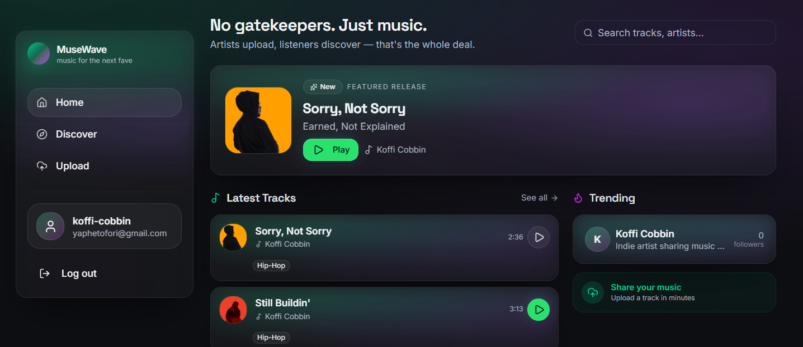

# MuseWave 🎵

> **Music for the next fave.**  
> A home for indie artists to upload tracks, share releases, and help listeners discover new music — zero gatekeepers.

[](https://react.dev)
[](https://www.typescriptlang.org/)
[](https://vitejs.dev)
[](https://tailwindcss.com)
[](https://www.django-rest-framework.org/)
[](https://opensource.org/licenses/MIT)

---

## Screenshots

<p align="center">
  
</p>

---

## Table of Contents

- [Features](#features)
- [Tech Stack](#tech-stack)
- [Architecture](#architecture)
- [Project Structure](#project-structure)
- [Getting Started](#getting-started)
- [Available Scripts](#available-scripts)
- [Environment Variables](#environment-variables)
- [Frontend Overview](#frontend-overview)
- [API Integration](#api-integration)
- [Authentication](#authentication)
- [Music Player](#music-player)
- [Playlists](#playlists)
- [Deployment](#deployment)
- [Contributing](#contributing)
- [License](#license)

---

## Features

### 🎵 Track Management
- Upload audio files with metadata (title, artist, genre, mood, tags)
- Stream audio with HTTP range-request support
- Download tracks as file attachments
- Rich metadata: BPM, musical key, lyrics, cover art, waveform data
- Edit and delete tracks with ownership enforcement

### 🎧 Music Player
- Persistent bottom player bar with play/pause, seek, skip, and volume controls
- Full-screen **PlayScreen** with album art, lyrics display, and sharing options
- Queue management — play next, previous, and queue insertion
- Auto-play configurable per track selection
- Like, download, and share tracks directly from the player

### 📋 Playlists
- Full CRUD: create, rename, delete playlists
- Add and remove tracks from playlists
- Drag-and-drop reordering (planned)
- **Collaborative sharing** — share playlists via link with view/edit permissions
- Shared playlist view for recipients (no login required with link)
- Search and filter your playlists

### 🎨 Artist Profiles
- Dedicated artist pages with bio, stats, and social links
- Follower count, monthly listener metrics
- Track listing with play controls
- Album discography display
- Support/patronage dialog
- Profile customization (avatar, header image, location, website)

### 🔍 Discover & Search
- Browse all tracks with sort options: Latest, Most Played, Most Liked
- Genre filtering with horizontal pill selector
- Paginated results (8 tracks per page)
- Search tracks and artists via sidebar or discover page
- Full-text search backed by Django backend

### 👥 Social Features
- Follow/unfollow artists
- Like/unlike tracks
- Email verification and password reset flows
- JWT authentication with automatic token refresh

### 📊 Analytics
- Per-track statistics: daily plays, unique listeners, average listen duration, completion rate
- Per-user statistics: total tracks, plays, likes, downloads, followers, monthly listeners
- Play tracking with duration and completion metrics

### 🎨 Design
- **"Dark Future Studio"** theme — deep charcoal backgrounds, emerald green accents, glassmorphism surfaces
- Responsive design — mobile bottom navigation, desktop sidebar layout
- Smooth animations powered by Framer Motion
- shadcn/ui component library with Radix UI primitives
- Noise textures, glow effects, and gradient backgrounds

---

## Tech Stack

### Frontend
| Category | Technology |
|----------|-----------|
| **Core** | [React 19](https://react.dev/), [TypeScript](https://www.typescriptlang.org/), [Vite 7](https://vitejs.dev/) |
| **Routing** | [Wouter](https://github.com/molefrog/wouter) — minimal client-side router |
| **UI Components** | [shadcn/ui](https://ui.shadcn.com/) (New York style), [Radix UI](https://www.radix-ui.com/) primitives |
| **Styling** | [Tailwind CSS v4](https://tailwindcss.com/), CSS variables design tokens |
| **Animation** | [Framer Motion](https://www.framer.com/motion/) |
| **Data Fetching** | [TanStack React Query](https://tanstack.com/query/latest) |
| **Forms** | [React Hook Form](https://react-hook-form.com/) + [Zod](https://zod.dev/) validation |
| **Icons** | [Lucide React](https://lucide.dev/), [React Icons](https://react-icons.github.io/react-icons/) |
| **Rich Text** | [Tiptap](https://tiptap.dev/) (lyrics editor) |
| **Charts** | [Recharts](https://recharts.org/) |
| **Carousel** | [Embla Carousel](https://www.embla-carousel.com/) |
| **Toast** | [Sonner](https://sonner.emilkowal ski.com/) |

### Backend
| Category | Technology |
|----------|-----------|
| **Local Dev Server** | [Express 5](https://expressjs.com/) |
| **Production API** | [Django REST Framework](https://www.django-rest-framework.org/) (hosted externally) |
| **Database** | PostgreSQL |
| **ORM (schema)** | [Drizzle ORM](https://orm.drizzle.team/) |
| **Auth** | JWT via [Django SimpleJWT](https://django-rest-framework-simplejwt.readthedocs.io/) |
| **Real-time** | [WebSockets](https://github.com/websockets/ws) |
| **Build** | [esbuild](https://esbuild.github.io/) (server bundling), Vite (client bundling) |

---

## Architecture

```
┌─────────────────────────────────────────────────────────────────┐
│                         Browser                                  │
│  ┌───────────────────────────────────────────────────────────┐  │
│  │              React SPA (Vite 7)                           │  │
│  │  ┌──────────┐  ┌──────────┐  ┌───────────────────────┐  │  │
│  │  │AuthContext│  │PlayerCtx │  │PlaylistContext        │  │  │
│  │  └─────┬────┘  └────┬─────┘  └──────────┬────────────┘  │  │
│  │        │            │                   │                 │  │
│  │  ┌─────┴────────────┴───────────────────┴────────────┐  │  │
│  │  │              Pages (Wouter Router)                 │  │  │
│  │  │  Home | Discover | Upload | Artist | Playlists    │  │  │
│  │  │  PlaylistDetail | SharedPlaylist | VerifyEmail    │  │  │
│  │  │  ResetPassword | 404                              │  │  │
│  │  └───────────────────────┬───────────────────────────┘  │  │
│  │                          │                                │  │
│  │  ┌───────────────────────▼───────────────────────────┐  │  │
│  │  │           API Client (apiRequestJson)               │  │  │
│  │  │   ~ snake_case ↔ camelCase auto-transformation ~   │  │  │
│  │  │   ~ JWT Bearer token injection ~                    │  │  │
│  │  │   ~ Automatic 401 → token refresh retry ~          │  │  │
│  │  └───────────────────────┬───────────────────────────┘  │  │
│  └──────────────────────────┼──────────────────────────────┘  │
└─────────────────────────────┼────────────────────────────────┘
                              │ HTTPS
┌─────────────────────────────▼────────────────────────────────┐
│              Django REST Framework API                        │
│         Hosted at https://kofficobbin.pythonanywhere.com      │
│                                                               │
│  ┌──────────┐  ┌──────────┐  ┌──────────┐  ┌──────────────┐  │
│  │  Users   │  │  Tracks  │  │ Playlists│  │  Social      │  │
│  │  Auth    │  │  Albums  │  │ Shares   │  │  Likes       │  │
│  │  Profiles│  │  Stream  │  │          │  │  Follows     │  │
│  └──────────┘  └──────────┘  └──────────┘  │  Comments    │  │
│                                             └──────────────┘  │
│  ┌──────────┐  ┌──────────┐                                    │
│  │Analytics │  │  Search  │    PostgreSQL Database              │
│  │ Stats    │  │  Index   │                                    │
│  └──────────┘  └──────────┘                                    │
└─────────────────────────────────────────────────────────────────┘
```

### Key Design Decisions

1. **Separated Backend**: The Django REST API runs independently. The Express server in this repo only serves the Vite-built frontend in production (or proxies Vite in development). All actual API logic lives in the Django backend.

2. **Case Transformation Layer**: The Django API uses `snake_case` but the React frontend uses `camelCase`. The `apiRequestJson` utility automatically transforms all request bodies (`camelCase` → `snake_case`) and response bodies (`snake_case` → `camelCase`).

3. **JWT Auto-Refresh**: If any API call returns a 401, the client automatically attempts a token refresh before retrying. This makes authentication transparent to the user.

4. **Context-Driven State**: Auth, Player, and Playlist state are managed via React Context providers, avoiding prop drilling for cross-cutting concerns.

---

## Project Structure

```
MuseWave/
├── client/                          # React frontend
│   ├── src/
│   │   ├── components/
│   │   │   ├── ui/                  # shadcn/ui primitives
│   │   │   │   ├── accordion.tsx
│   │   │   │   ├── button.tsx
│   │   │   │   ├── card.tsx
│   │   │   │   ├── dialog.tsx
│   │   │   │   ├── dropdown-menu.tsx
│   │   │   │   ├── input.tsx
│   │   │   │   ├── toast.tsx
│   │   │   │   └── ... (60+ components)
│   │   │   ├── playlists/
│   │   │   │   ├── PlaylistCard.tsx
│   │   │   │   ├── CreatePlaylistModal.tsx
│   │   │   │   ├── RenamePlaylistModal.tsx
│   │   │   │   ├── SharePlaylistModal.tsx
│   │   │   │   └── TrackActionsMenu.tsx
│   │   │   ├── BottomNav.tsx          # Mobile bottom navigation
│   │   │   ├── LoginModal.tsx         # Login/signup dialog
│   │   │   ├── LoginDialog.tsx
│   │   │   ├── PlayerBar.tsx          # Persistent audio player bar
│   │   │   ├── PlayScreen.tsx         # Full-screen player view
│   │   │   ├── TrackCard.tsx          # Shared track card component
│   │   │   ├── LyricsEditor.tsx       # Tiptap-based lyrics editor
│   │   │   └── album-create.tsx       # Album creation component
│   │   ├── contexts/
│   │   │   ├── auth-context.tsx        # JWT authentication state
│   │   │   ├── player-context.tsx      # Audio player state & queue
│   │   │   └── playlist-context.tsx    # Playlist CRUD state
│   │   ├── hooks/
│   │   │   ├── use-genres.ts           # Genre list fetching
│   │   │   ├── use-mobile.tsx          # Mobile detection hook
│   │   │   └── use-toast.ts            # Toast notification hook
│   │   ├── lib/
│   │   │   ├── apiConfig.ts            # API endpoints config
│   │   │   ├── queryClient.ts          # API client with JWT & case transform
│   │   │   ├── caseTransform.ts        # snake_case ↔ camelCase utilities
│   │   │   └── utils.ts                # Shared utilities
│   │   ├── pages/
│   │   │   ├── home.tsx                # Landing page (hero, tracks, trending)
│   │   │   ├── discover.tsx            # Browse tracks with filters
│   │   │   ├── upload.tsx              # Track upload form
│   │   │   ├── artist.tsx              # Artist profile page
│   │   │   ├── playlists.tsx           # User's playlist list
│   │   │   ├── playlist-detail.tsx     # Single playlist view
│   │   │   ├── shared-playlist.tsx     # Shared/shared playlist view
│   │   │   ├── verify-email.tsx        # Email verification handler
│   │   │   ├── reset-password.tsx      # Password reset form
│   │   │   └── not-found.tsx           # 404 page
│   │   ├── App.tsx                     # Root component & router
│   │   ├── main.tsx                    # Entry point
│   │   └── index.css                   # Global styles & design tokens
│   └── index.html                      # HTML template
├── server/                            # Express dev server
│   ├── index.ts                       # Server entry (middleware + routes)
│   ├── routes.ts                      # API routes (delegates to Django)
│   ├── static.ts                      # Production static file serving
│   └── vite.ts                        # Vite dev middleware setup
├── shared/                            # Shared between client & server
│   └── schema.ts                      # Zod schemas (User, Track, Album, Playlist, etc.)
├── script/
│   └── build.ts                       # Production build script (esbuild + Vite)
├── public/                            # Static assets
│   ├── assets/
│   │   └── homepage.png               # Homepage screenshot
│   └── index.html                     # Built HTML template
├── dist/                              # Build output
├── .env.development                   # Development environment
├── .env.production                    # Production environment
├── drizzle.config.ts                  # Drizzle ORM configuration
├── postcss.config.js                  # PostCSS config
├── tsconfig.json                      # TypeScript configuration
├── vite.config.ts                     # Vite configuration
├── components.json                    # shadcn/ui configuration
└── package.json                       # Dependencies & scripts
```

---

## Getting Started

### Prerequisites

- [Node.js](https://nodejs.org/) >= 20.x
- npm or yarn
- A running instance of the [Django REST backend](https://github.com/your-org/musewave-backend) (or access to the hosted API)

### Installation

```bash
# Clone the repository
git clone https://github.com/your-org/musewave.git
cd musewave

# Install dependencies
npm install
```

### Configuration

Create a `.env.local` file in the project root (or modify the existing `.env.development`):

```env
VITE_API_URL=https://your-django-backend.com
```

The default points to `https://kofficobbin.pythonanywhere.com` — the hosted Django API.

### Development

```bash
# Start both the Vite dev server and Express API server
npm run dev

# Or run them separately:
npm run dev:client   # Vite dev server only (port 5000)
npm run dev          # Full stack with Express
```

The app will be available at `http://localhost:5000`.

### Production Build

```bash
# Build client + bundle server
npm run build

# Start production server
npm start
```

---

## Available Scripts

| Script | Command | Description |
|--------|---------|-------------|
| `dev` | `cross-env NODE_ENV=development tsx server/index.ts` | Start full dev server (Express + Vite middleware) |
| `dev:client` | `vite dev --port 5000` | Start Vite dev server only (standalone frontend) |
| `build` | `tsx script/build.ts` | Build client (Vite) + bundle server (esbuild) into `dist/` |
| `start` | `cross-env NODE_ENV=production node dist/index.cjs` | Start production server serving built assets |
| `check` | `tsc` | Run TypeScript type checking (no emit) |
| `db:push` | `drizzle-kit push` | Push Drizzle schema to PostgreSQL database |

---

## Environment Variables

| Variable | Required | Default | Description |
|----------|----------|---------|-------------|
| `VITE_API_URL` | Yes | — | Base URL for the Django REST API backend |
| `DATABASE_URL` | For DB ops | — | PostgreSQL connection string (for Drizzle) |
| `PORT` | No | `5000` | Port for the Express server |
| `NODE_ENV` | No | `development` | Environment mode (`development` / `production`) |

---

## Frontend Overview

### Routing (Wouter)

| Route | Page Component | Description |
|-------|---------------|-------------|
| `/` | `Home` | Landing page with hero, latest tracks, trending artists |
| `/discover` | `Discover` | Browse all tracks with sorting, filtering, pagination |
| `/upload` | `Upload` | Track upload form with metadata |
| `/artist/:slug` | `Artist` | Artist profile page with stats and tracks |
| `/playlists` | `Playlists` | User's playlist collection |
| `/playlists/:id` | `PlaylistDetail` | Single playlist with track listing |
| `/playlists/link/:token` | `SharedPlaylist` | Shared playlist view (public link) |
| `/verify-email/:uidb64/:token` | `VerifyEmail` | Email verification handler |
| `/reset-password/:uid/:token` | `ResetPassword` | Password reset form |
| `*` | `NotFound` | 404 page |

### State Management

Three React Context providers wrap the application:

1. **AuthContext** (`auth-context.tsx`)
   - Manages user authentication state
   - Provides `login()`, `logout()`, `user`, `isAuthenticated`
   - Persists JWT tokens in `localStorage`
   - Loads user profile from the API on app mount

2. **PlayerContext** (`player-context.tsx`)
   - Manages the active track, playback state, and queue
   - Provides `setActive()`, `setQueue()`, `insertNext()`, `playNext()`, `playPrev()`
   - Supports playlists queueing with next/previous navigation

3. **PlaylistContext** (`playlist-context.tsx`)
   - Manages user playlists and the currently viewed playlist
   - Provides CRUD operations: `fetchPlaylists()`, `createPlaylist()`, `deletePlaylist()`, `renamePlaylist()`
   - Track management: `addSongToPlaylist()`, `removeSongFromPlaylist()`
   - Sharing: `sharePlaylistWithUser()`, `fetchPlaylistByLink()`

### UI Components

The app uses a comprehensive set of **shadcn/ui** components built on **Radix UI** primitives:

- **Layout**: Sidebar, Sheet, Resizable panels, Scroll area
- **Input**: Input, Textarea, Select, Checkbox, Radio group, Switch, Input OTP
- **Feedback**: Toast (Sonner), Alert dialog, Dialog, Progress, Skeleton, Spinner
- **Navigation**: Tabs, Navigation menu, Menubar, Breadcrumb, Pagination
- **Data Display**: Table, Card, Avatar, Badge, Separator, Tooltip
- **Overlays**: Popover, Dropdown menu, Context menu, Hover card, Command (cmd+k)
- **Media**: Carousel, Aspect ratio

### Custom Components

- **PlayerBar** — Fixed-bottom audio player with play/pause, seek bar, track info, volume, and full-screen toggle
- **PlayScreen** — Full-screen immersive player with album art, seekable waveform/progress, lyrics display, like/download/share
- **TrackCard** — Reusable card used across Home, Discover, and Artist pages with play, menu, and add-to-playlist actions
- **BottomNav** — Mobile bottom navigation bar (Home, Discover, Upload, Account)
- **LoginModal** — Authentication dialog with login/signup forms
- **LyricsEditor** — Tiptap-based rich text editor for track lyrics

---

## API Integration

### Client Architecture

The API client is built in `client/src/lib/queryClient.ts` with these features:

- **Automatic case conversion**: Request bodies are converted from `camelCase` → `snake_case` before sending. Response bodies are converted from `snake_case` → `camelCase` on receipt.
- **JWT token injection**: The `accessToken` from `localStorage` is automatically attached as a `Bearer` token in the `Authorization` header.
- **Automatic 401 retry**: If a request returns 401, the client attempts a silent token refresh using the stored `refreshToken`. If successful, it retries the original request. If the refresh fails, all tokens are cleared.
- **Error normalization**: Server errors are parsed for meaningful messages (`error`, `detail`, `message` fields) and thrown as typed errors with `status` codes.

### Key API Endpoints

All endpoints documented in the internal `BACKEND_API_DOCUMENTATION.md`. The API config is centralized in `client/src/lib/apiConfig.ts`:

| Category | Endpoints |
|----------|-----------|
| **Auth** | `POST /api/users/login`, `POST /api/users/logout`, `POST /api/users/refresh` |
| **Users** | `GET /api/users/:id`, `PATCH /api/users/:id`, `GET /api/users/username/:username` |
| **Tracks** | `GET /api/tracks`, `POST /api/tracks`, `GET /api/tracks/:id/stream/`, `GET /api/tracks/:id/download/` |
| **Albums** | `POST /api/albums`, `GET /api/albums/:id`, `PATCH /api/albums/:id/update` |
| **Playlists** | `GET /api/playlists`, `POST /api/playlists`, `POST /api/playlists/:id/add-track` |
| **Social** | `POST /api/tracks/:id/like`, `POST /api/users/:id/follow` |
| **Search** | `GET /api/search?q=...` |
| **Analytics** | `GET /api/users/:id/stats`, `GET /api/tracks/:id/stats` |

---

## Authentication

MuseWave uses **JWT (JSON Web Tokens)** for authentication via the Django REST backend.

### Auth Flow

1. **Login**: User submits email/username + password → backend returns `access` + `refresh` tokens + user data
2. **Token Storage**: Tokens and `userId` are stored in `localStorage`
3. **Authenticated Requests**: The `apiRequestJson` function injects the `accessToken` as a `Bearer` token in every request
4. **Token Refresh**: When a request returns `401`, the client automatically calls `/api/users/refresh` with the stored `refreshToken` to obtain new tokens
5. **Session Restoration**: On page reload, if tokens exist in `localStorage`, the auth context fetches the user profile to restore the session
6. **Logout**: Clears tokens from `localStorage` and calls the backend logout endpoint

### Pages

- **Login**: Via `LoginModal` component (dialog overlay on any page)
- **Sign Up**: Via `LoginModal` (tab-based — login/register in the same dialog)
- **Email Verification**: `GET /api/users/verify-email/:uidb64/:token/` — handled by `VerifyEmail` page
- **Password Reset**: `POST /api/users/password/reset` → email → `POST /api/users/password/reset/confirm` — handled by `ResetPassword` page

---

## Music Player

### Player Bar (`PlayerBar.tsx`)

The persistent bottom player bar is always visible when a track is selected:

- **Track info**: Album art thumbnail, title, artist
- **Controls**: Play/pause, skip forward, skip backward
- **Seek bar**: Draggable progress bar with time display
- **Volume**: Slider control
- **Actions**: Like (heart), download, share, support artist
- **Expand**: Opens full-screen PlayScreen

### Play Screen (`PlayScreen.tsx`)

An immersive full-screen player dialog:

- **Large album art** with gradient background
- **Seek bar** with current/total time
- **Playback controls**: Play/pause, skip, rewind 10s, forward 10s
- **Lyrics display**: Scrollable, sanitized HTML lyrics via DOMPurify
- **Volume slider** with mute toggle
- **Actions**: Like, download, share, view artist page
- **Keyboard shortcuts**: Space (play/pause), arrows (seek)

### Queue Management

The `PlayerContext` manages a track queue:

- `setQueue(tracks, startIndex)` — Load a list of tracks starting at a given index
- `insertNext(track)` — Insert a track to play after the current one
- `playNext()` / `playPrev()` — Navigate the queue
- `hasNext` / `hasPrev` — Computed flags for UI state

---

## Playlists

The playlist system supports full CRUD with collaborative sharing:

### Features
- **Create**: Name + optional description via `CreatePlaylistModal`
- **Read**: List view (`/playlists`) and detail view (`/playlists/:id`) with track listing
- **Update**: Rename and change description via `RenamePlaylistModal`
- **Delete**: With confirmation dialog
- **Add Tracks**: From any `TrackCard` via the `AddToPlaylistButton` dropdown
- **Remove Tracks**: From playlist detail view
- **Share**: Share with specific users (view/edit permissions) or generate a shareable link

### Sharing
- **User shares**: Grant `view` or `edit` permissions to specific users
- **Link sharing**: Generate a public token link for anyone to view
- **Shared playlists**: Accessible at `/playlists/link/:token` — no login required
- **Shared with me**: View playlists others have shared with you

---

## Deployment

### Production Build

The `build` script (`script/build.ts`) uses a two-step process:

1. **Client**: Built with Vite → outputs to `dist/public/`
2. **Server**: Bundled with esbuild → outputs `dist/index.cjs`

The bundled server includes only an allow-list of dependencies (express, drizzle-orm, passport, etc.) while externalizing the rest.

### Hosting

The app is designed to be deployed anywhere Node.js runs:

```bash
# Build
npm run build

# Start
NODE_ENV=production node dist/index.cjs
```

The Express server serves the static files from `dist/public/` in production mode. For the Django backend, update `VITE_API_URL` in your environment variables.

### Firebase

The project includes Firebase hosting configuration (`.firebaserc`, `firebase.json`) for deploying the static frontend to Firebase Hosting.

---

## Contributing

1. Fork the repository
2. Create a feature branch: `git checkout -b feature/my-feature`
3. Commit your changes: `git commit -am 'Add my feature'`
4. Push to the branch: `git push origin feature/my-feature`
5. Open a Pull Request

### Development Guidelines

- Follow existing TypeScript patterns and naming conventions
- Use Zod schemas from `shared/schema.ts` for type definitions
- Keep components focused with single responsibility
- Use the existing Context providers for cross-cutting state
- Add tests for new features
- Ensure mobile responsiveness for UI changes

---

## License

This project is licensed under the MIT License — see the [LICENSE](LICENSE) file for details.

---

## Acknowledgments

- Built with [shadcn/ui](https://ui.shadcn.com/) components
- Audio handling via [Django REST Framework](https://www.django-rest-framework.org/)
- Deployed on [PythonAnywhere](https://www.pythonanywhere.com/)
- Icons by [Lucide](https://lucide.dev/) and [React Icons](https://react-icons.github.io/react-icons/)
- Fonts: [Inter](https://rsms.me/inter/) + [Space Grotesk](https://fonts.google.com/specimen/Space+Grotesk)

---

<p align="center">
  <strong>MuseWave</strong> — music for the next fave.<br />
  <sub>No gatekeepers. Just music.</sub>
</p>
